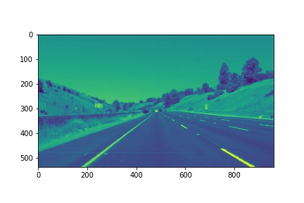

# **Finding Lane Lines on the Road** 

[//]: # (Image References)

[image1]: ./examples/grayscale.jpg "Grayscale"

---
### 1. Lane lines detection pipeline
My pipeline is consisted of 5 steps. 
- Convert the images to grayscale
- Blur the images by a Gaussian function to reduce the noise and details, with kernel size equal to 5
- Apply Opencv Canny function to detect the edges of lines
- Mask the region where we suppose that lane lines will appear in the images
- Implement Hough transformation on the canny edges, and draw the lines
  - Apply Hough transformation on the canny edges to get the lines
  - Calculate the slope of each line, skip lines with absolute slopes less than 0.1
  - Define a LineCollection class, save lines with positive slopes and negative slopes to two objects of LineCollection respectively. Positive lines are categorized as 'left', and negative as 'right'.
  - Remove outliers with slopes below Q1 - IQR or above Q3 + IQR (IQR is "interquartile range")
  - Calculate weighted average of slopes (k) and intersections (b). Weight is the distance square of the line, which indicates that the slope is determined more by the longer lines than the shorter lines.
  - Draw the line using y = kx + b between y_max and y_min, where y_max and y_min are the bottom and top vertices of the masked region.

Gray Image             |  Gaussian Blur
:-------------------------:|:-------------------------:
  |  

Canny Edges | Masked Region
:-------------------------:|:-------------------------:
  |  

Hough Transformation | Lane Lines
:-------------------------:|:-------------------------:
  |  

### 2. Identify potential shortcomings with your current pipeline
- Fixed vertices of masked region makes my algorithm lose generality. For example, lane lines are located in a different region of the challenging vedio, therefore, using the fixed masked region will introduce noises or miss the lanes.
- The algorithm supposes that the lane lines are linear, but there is curvature in the far end of the lines.
- The parameters of Hough transformation are also fixed, where minimum number of pixels making up a line is 60 and maximum gap in pixels between connectable lines segments are 25. These thresholds filter out lanes in some image of the challenging video. 

### 3. Suggest possible improvements to your pipeline
- Instead of using a fixed maksed region, we can apply Hough transformation after getting canny edges, then we can define the vertices of masked region based on the leftmost and rightmost lines.
- After lines are categorized into 'left' and 'right' by their slopes, a quadratic function might be better than a linear function to fit the line.
